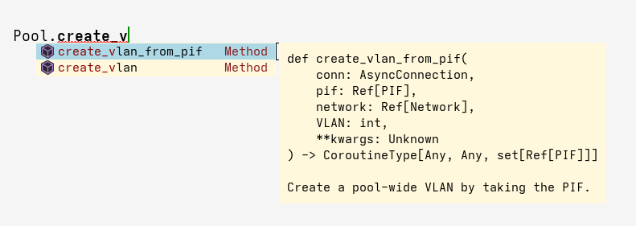

# xapy

Generate type-annotated bindings for XenAPI.



---

## Usage

To generate bindings, you require `xenapi.json` from within the `xen-api` build
folder.
For example purposes, this repo contains an `xenapi-26.1-lcm.json` file,
sourced from a build of the `26.1-lcm` branch.

To create bindings, invoke `main.py`:
```bash
python main.py xenapi.json > xapy.py
```

You can also create an asynchronous version of the bindings by supply
`--is-async` to the invocation:
```bash
python main.py --is-async xenapi.json > xapy.py
```

For the synchronous version, `requests` is required.
For the asynchronous version, `aiohttp` is required.

## Example

Below is an example, using the asynchronous bindings, that demonstrates how a
concurrent task can monitor object events:

```python
from xapy import *
import asyncio
from pprint import pprint

async def watcher(c):
    print('created watcher task')
    cls = set(['Observer'])
    token = ''
    while True:
        try:
            res = await Event._from(c, cls, token, 2)
            token = res.get('token', '')
            for e in res.get('events'):
                match e['operation']:
                    case 'add':
                        obj = Observer.unmarshal(e['snapshot'])
                        print('created an observer:')
                        pprint(obj)
                    case 'del':
                        print('deleted an observer')
        except asyncio.CancelledError:
            print('cancelled watcher')
            break

async def main():
    async with AsyncConnection('http://localhost:8080') as c:
        await Session.login_with_password(c, 'root', 'password')
        for o in await Observer.get_all(c):
            await Observer.destroy(c, o)
        task = asyncio.create_task(watcher(c))
        await asyncio.sleep(2)
        o = await Observer.create(
            c,
            Observer.Record(
                uuid='',
                name_label='foo',
                name_description='foo description',
                hosts = set(),
                attributes = {},
                endpoints = set(),
                components = set (),
                enabled=False
            )
        )
        await asyncio.sleep(1)
        await Observer.destroy(c, o)
        await asyncio.sleep(1)
        task.cancel()
        await Session.logout(c)

if __name__ == '__main__':
    asyncio.run(main())
```

An example run may print:
```
~/xapy » python demo.py                                                                                                                                                       dosto@evsky
created watcher task
created an observer:
Record(uuid='e285fda0-2162-5f3d-7ec0-bafefd6f02fb',
       name_label='foo',
       name_description='foo description',
       hosts=set(),
       attributes={},
       endpoints=set(),
       components=set(),
       enabled=False)
deleted an observer
cancelled watcher
```

## Usage Notes

- The asynchronous version of the bindings permit you to pass a keyword
  argument `timeout` to each message invocation (e.g. `timeout=2`). This will
  raise the standard `TimeoutError` exception.
- The marshalling/unmarshalling routines are available to the user. In the
  example above, `Observer.unmarshal` is used to create an Observer record
  instance from the - otherwise opaque - result of `event.from`.
- Optional arguments work but are modelled against the current behaviour of
  XenAPI. In particular, you cannot omit an argument from the middle. Thus,
  code generation for optional arguments stops on the first `None` it sees.

Consider `session.login_with_password` which permits two optional arguments
(`version` and `originator`):
```py
    @staticmethod
    async def login_with_password(conn: AsyncConnection, uname: str, pwd: str, version: str | None = None, originator: str | None = None, **kwargs) -> Ref[Session]:
        """Attempt to authenticate the user, returning a session reference if successful"""
        _ps = []
        _ps.append(_id(uname))
        _ps.append(_id(pwd))
        _trs : list[Any] = [_id,_id]
        _opts : list[Any] = [version,originator]
        for _i, _o in enumerate(_opts):
            if _o is None:
                break
            _ps.append(_trs[_i](_o))

        _res = await conn.call('session.login_with_password', _ps, **kwargs)
        conn.session = Ref(_res)
        return ref_of(_res)
```
These optional arguments are appended to the parameter listing so long as they are non-`None`.
This means that an invocation like `session.login_with_password('u', 'p', None, 'o')` 
is ill-formed, but this is because of a limitation in XenAPI (whereby you can
only omit a suffix of the optional arguments).
